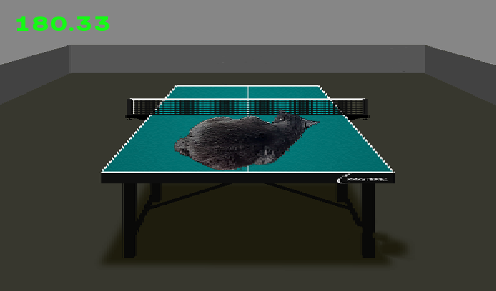
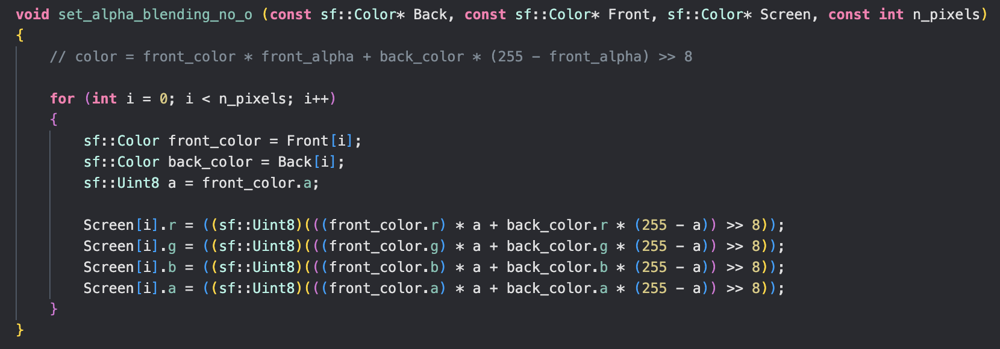

# Оптимизация алгоритма альфа-блендинга

## О ПРОЕКТЕ

В этой работе я попытался оптимизировать алгоритм объединения изображений, используя доступные на моем компьютере SIMD-инструкции: SSE и AVX2.

## Алгоритм альфа-блендинга

Этот алгоритм широко используется для объединения изображений. Есть два снимка: задний и передний. Второй должен быть наложен на первый. 

Расмотрим алгоритм объединения без применения оптимизаций:

Чтобы объединить изображения одинакового размера, мы используем алгоритм, который берет каждый пиксель обоих изображений (массивы спереди и сзади) и вычисляет пиксели результирующего изображения (массив экрана) с помощью простых инструментов:

``color = (front_color * front_alpha + back_color * (255 - front_alpha) >> 8)``

Как мы видим, производительность алгоритма прямо пропорционально зависит от размера изображений.
