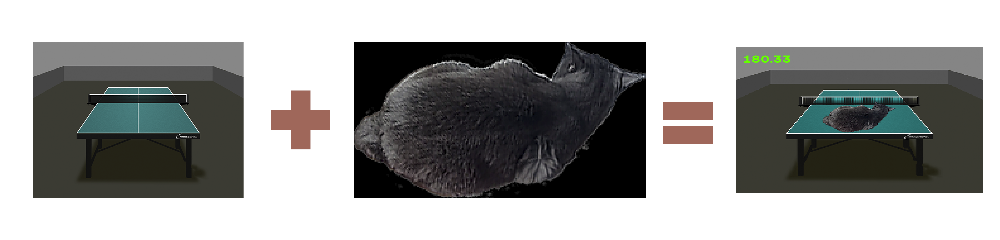

# Оптимизация алгоритма альфа-блендинга
## О ПРОЕКТЕ

**Alpha Blending** - это процесс комбинирования двух изображений на экране с учётом их альфа-каналов. Альфа-канал характеризует прозрачность изображения. В данной работе мы будем накладывать одно изображение на другое.

## Алгоритм альфа-блендинга

Этот алгоритм широко используется для объединения изображений. Есть два снимка: задний и передний. Второй должен быть наложен на первый. 

Расмотрим алгоритм объединения без применения оптимизаций:

Чтобы объединить изображения одинакового размера, мы используем алгоритм, который берет каждый пиксель обоих изображений (массивы спереди и сзади) и вычисляет пиксели результирующего изображения (массив экрана) с помощью простых инструментов:

``color = (front_color * front_alpha + back_color * (255 - front_alpha) >> 8)``

Как мы видим, производительность алгоритма прямо пропорционально зависит от размера изображений.

## Принципы оптимизации

## Результаты оптимизаций

В таблице ниже приведены значения FPS, измеренные для различных режимов оптимизации:

|Оптимизаиция \ Флаг|НЕТ |-O0 |-O1 |-O2 |-O3 |-Ofast |
|:------------------|:--:|:--:|:--:|:--:|:--:|:-----:|
|БЕЗ оптимизаций    | | | | | |    |
|                   |    |    |    |    |    |       |
|SSE инструкции     | | | | | |    |
|                   |    |    |    |    |    |       |
|AVX инструкции     | | | | | |    |

## Вывод
Оптимизация алгоритма рисования множества Мандельброта с использованием инстукций AVX512 позволяет его ускорить в **12.1/2.2 = 5.5** раз

